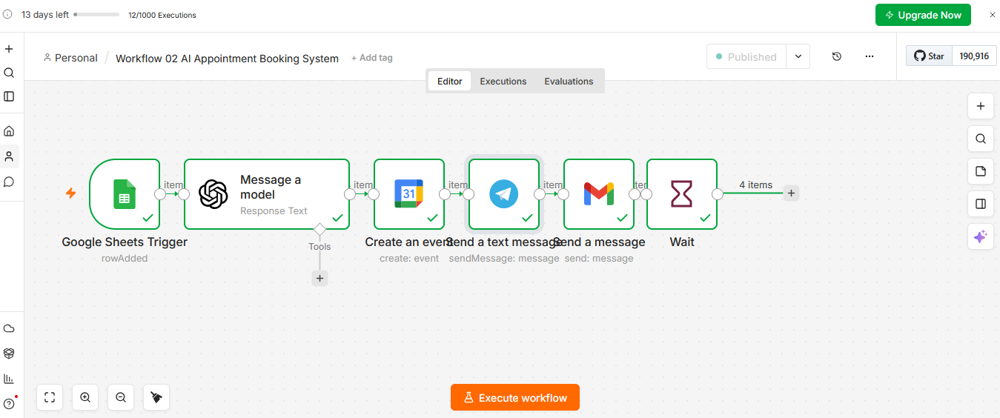
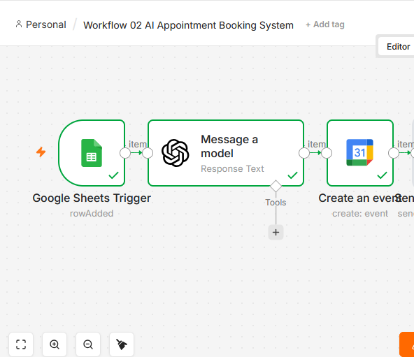

# AI Appointment Booking & Business Management System

Built with n8n | AI-Powered Automation | Portfolio Project

---

## Overview

One of the most common problems in service-based businesses is managing appointments efficiently.

Appointment requests often arrive through forms, emails, messages, or phone calls. As the number of appointments grows, business owners spend more time managing schedules, sending confirmations, following up with customers, and updating spreadsheets manually.

I built this workflow to solve that problem.

This project automates the complete appointment management process—from appointment request submission to scheduling, customer communication, notifications, reporting, and revenue tracking.

Instead of manually handling appointments, the entire process runs automatically.

---

## The Business Problem

Many businesses struggle with:

* Missed appointment requests
* Delayed responses
* Manual calendar management
* Forgotten follow-ups
* No appointment tracking
* No visibility into revenue
* Poor customer experience

As appointment volume increases, these small issues become expensive operational problems.

---

## The Solution

This workflow creates a centralized appointment management system powered by AI and automation.

Every appointment request is automatically processed and tracked.

Customer submits appointment request
↓
Google Sheets receives request
↓
n8n detects new submission
↓
AI generates appointment summary
↓
Google Calendar event created
↓
Telegram notification sent
↓
Confirmation email sent
↓
Reminder email sent
↓
Appointment status tracked
↓
Revenue tracked
↓
Dashboard updated

No manual scheduling required.

---

## Real-World Use Cases

This workflow can be used by:

* Consultants
* Agencies
* Coaches
* Freelancers
* Healthcare Clinics
* Real Estate Professionals
* Marketing Agencies
* Service Businesses
* Appointment-Based Businesses

Any business that books appointments can use this system.

---

## Workflow Features

### Appointment Capture

Automatically collects appointment requests through Google Forms.

### AI Appointment Summary

Generates a clean summary of every appointment request using OpenAI.

### Automatic Calendar Scheduling

Creates Google Calendar events automatically.

### Telegram Notifications

Sends instant notifications to the business owner.

### Confirmation Emails

Automatically confirms appointment bookings.

### Reminder Emails

Sends reminders before appointments.

### Appointment Status Tracking

Tracks:

* Pending
* Completed
* Cancelled

### Revenue Tracking

Captures appointment value and tracks revenue automatically.

### Business Dashboard

Displays:

* Total Appointments
* Pending Appointments
* Completed Appointments
* Cancelled Appointments
* Total Revenue

---

## Workflow Architecture

Google Form
↓
Google Sheets
↓
Google Sheets Trigger
↓
OpenAI
↓
Google Calendar
↓
Telegram
↓
Confirmation Email
↓
Reminder Email
↓
Status Tracking
↓
Dashboard Reporting

---

## Project Screenshots

### Complete Workflow

### Business Dashboard

### Google Calendar Event

### Telegram Notification

### Confirmation Email

---

## Tools Used

### Automation

* n8n

### AI

* OpenAI

### Google Workspace

* Google Forms
* Google Sheets
* Google Calendar
* Gmail

### Notifications

* Telegram

---

## Project Structure

workflow-02-ai-appointment-booking-system

├── README.md

├── workflow-json
│ └── workflow.json

├── screenshots

├── documentation

├── demo-data

└── assets

---

## Testing Results

The workflow has been tested successfully.

### Validated Components

* Form Submission
* Google Sheets Trigger
* AI Summary Generation
* Calendar Event Creation
* Telegram Notifications
* Confirmation Emails
* Reminder Emails
* Status Tracking
* Revenue Tracking
* Dashboard Reporting

---

## Business Impact

This workflow helps businesses:

### Save Time

Reduces repetitive administrative work.

### Improve Customer Experience

Customers receive instant confirmation and reminders.

### Reduce Missed Appointments

Automated reminders improve attendance.

### Improve Visibility

Business owners can track appointments and revenue in one place.

### Scale Operations

The same workflow can handle a growing number of appointments without increasing manual workload.

---

## ROI Example

Without Automation:

* Manual appointment review
* Manual scheduling
* Manual reminders
* Manual tracking

Estimated effort:

1–3 hours per day

With Automation:

* Fully automated process
* Instant notifications
* Automatic scheduling
* Automatic reporting

Estimated effort:

Less than 10 minutes per day

---

## Pricing Guide

### Starter Package

Includes:

* Appointment Capture
* Google Sheets Integration

Price:

$75 – $100

### Standard Package

Includes:

* AI Summary
* Google Calendar
* Telegram Notifications
* Confirmation Emails
* Reminder Emails

Price:

$150 – $250

### Premium Package

Includes:

* Dashboard Reporting
* Revenue Tracking
* Status Tracking
* Business Analytics

Price:

$250 – $500

---

## Future Improvements

Potential upgrades:

* CRM Integration
* WhatsApp Notifications
* SMS Reminders
* Stripe Payments
* Appointment Rescheduling
* Customer Portal
* Multi-Agent Support

---

## What I Learned

This project helped me understand how to combine AI, automation, scheduling systems, notifications, and business reporting into a complete appointment management solution.

It demonstrates how automation can remove repetitive work while improving both customer experience and operational efficiency.

---

## Final Result

A complete AI-powered appointment management system that automates scheduling, communication, tracking, and reporting from a single workflow.

Core Principle:

No Appointment Should Be Missed.
